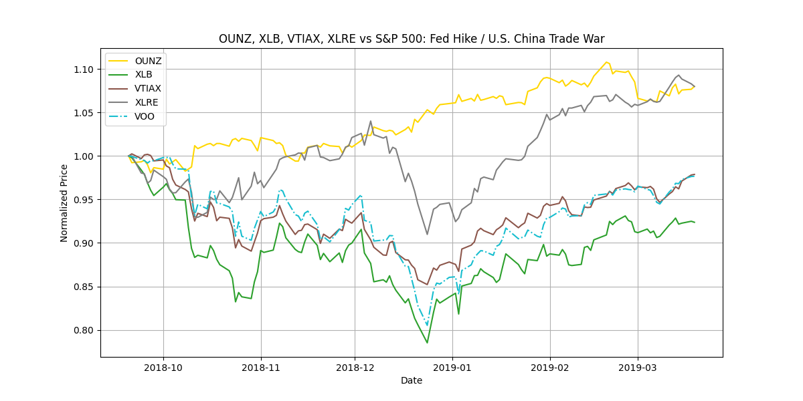

# Stock Trends Repository

This repository provides tools for analyzing stock trends over specific historical periods. Below is a guide on how to use the tools available in this repository.

## Repository Structure

- `stock_trends/data/`
  - Contains YAML files naming different time periods and stock tickers for which you want to plot data.
- `stock_trends/scripts/`
  - Contains scripts for processing and analyzing stock data.
- `stock_trends/utils/`
  - Contains utility modules for downloading, plotting, and comparing stock data.

## How to Use

### 1. Install Dependencies and Package

Install the required dependencies and the Python package by running:

```bash
pip install -e .
```

### 2. Process Ticker YAML

After installation, you can use the `process-ticker-yaml` entry point to process the YAML files in the `data` directory. E.g.:

```bash
process-ticker-yaml stock_trends/data/historical_tickers.yaml
```

### 3. Visualize Stock Trends

You can visualize stock trends by running the plotting script. Below is an example of a generated plot:


